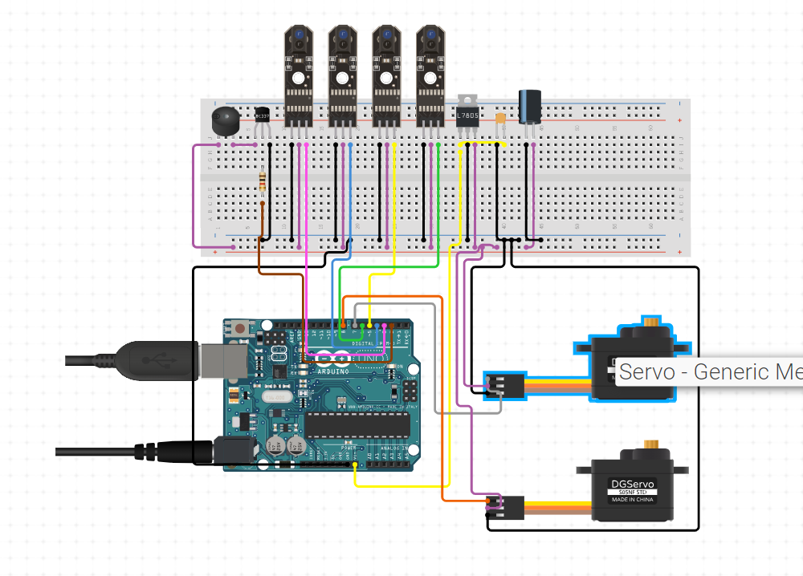

# 🚉 Automated Railway Crossing System

This project aims to create an automated railway crossing system using IR sensors and servo motors. The system detects approaching trains and lowers the crossing gate, raising it once the train has passed.



## 👥 Group Information

- **Group Number**: 11
- **Members**:
  - Unayes Ahmed Khan (Reg no: 2020331009)
  - Ibnul Mansib (Reg no: 2020331061)
  - Azizul Haque Munna (2020331107)
  - Sharif Mahmud Sazid (2020331042)
  - Sharmin Akther Juthi (2020331076)

## 📘 Project Overview

The automated railway crossing system operates as follows:
1. When two left-side IR sensors detect an object (e.g., an approaching train), the servos move to lower the crossing gate.
2. When the two right-side IR sensors detect the object after the left-side sensors, the servos raise the gate, indicating the train has passed.
3. The system also includes a buzzer and an LED to provide audio-visual signals.

## 🔧 Components

- **Arduino Uno**
- **4 IR Sensors**
- **2 Servo Motors**
- **1 Buzzer**
- **1 LED**

## 🛠️ Pin Connections

| Component       | Pin       |
| --------------- | --------- |
| Left IR Sensor 1 | 6        |
| Left IR Sensor 2 | 3        |
| Right IR Sensor 1 | 4       |
| Right IR Sensor 2 | 5       |
| Servo Motor 1   | 7         |
| Servo Motor 2   | 8         |
| Buzzer          | 2         |
| LED             | Built-in  |

## 📝 Code

```cpp
#include <Servo.h>

#define LEFT_IR1_PIN 6
#define LEFT_IR2_PIN 3
#define RIGHT_IR1_PIN 4
#define RIGHT_IR2_PIN 5
#define SERVO1_PIN 7
#define SERVO2_PIN 8
#define BUZZER_PIN 2

Servo servo1;
Servo servo2;
bool leftDetected = false;
bool rightDetected = false;
bool ok = true;

void setup() {
  pinMode(LEFT_IR1_PIN, INPUT);
  pinMode(LEFT_IR2_PIN, INPUT);
  pinMode(RIGHT_IR1_PIN, INPUT);
  pinMode(RIGHT_IR2_PIN, INPUT);
  pinMode(BUZZER_PIN, OUTPUT);
  pinMode(LED_BUILTIN, OUTPUT);
  servo1.attach(SERVO1_PIN);
  servo2.attach(SERVO2_PIN);
}

void loop() {
  if (ok) {
    servo1.write(0);
    servo2.write(0);
    ok = false;
  }

  if (!digitalRead(LEFT_IR1_PIN) && !digitalRead(LEFT_IR2_PIN) && !leftDetected && !rightDetected) {
    servo1.write(90);
    servo2.write(90);
    digitalWrite(BUZZER_PIN, HIGH);
    digitalWrite(LED_BUILTIN, HIGH);
    delay(1000);
    leftDetected = true;
  }
  
  if (!digitalRead(RIGHT_IR1_PIN) && !digitalRead(RIGHT_IR2_PIN) && !leftDetected && !rightDetected) {
    servo1.write(90);
    servo2.write(90);
    digitalWrite(BUZZER_PIN, HIGH);
    digitalWrite(LED_BUILTIN, LOW);
    delay(1000);
    rightDetected = true;
  }

  if (!digitalRead(LEFT_IR1_PIN) && !digitalRead(LEFT_IR2_PIN) && rightDetected) {
    servo1.write(0);
    servo2.write(0);
    digitalWrite(BUZZER_PIN, LOW);
    digitalWrite(LED_BUILTIN, HIGH);
    delay(1000);
    rightDetected = false;
  }

  if (!digitalRead(RIGHT_IR1_PIN) && !digitalRead(RIGHT_IR2_PIN) && leftDetected) {
    servo1.write(0);
    servo2.write(0);
    digitalWrite(BUZZER_PIN, LOW);
    digitalWrite(LED_BUILTIN, HIGH);
    delay(1000);
    leftDetected = false;
  }
}
```
## 🛤️ How It Works

1. **Initial State**: Both servos are set to 0 degrees, indicating the gate is up.
2. **Left Sensors Detect**: If either left IR sensor detects an object, and no previous detections are recorded, the servos move to 90 degrees to lower the gate. The buzzer sounds, and the LED turns on.
3. **Right Sensors Detect After Left**: If the right IR sensors detect an object after the left sensors, the servos return to 0 degrees to raise the gate. The buzzer stops, and the LED turns off.
4. **Right Sensors Detect**: If either right IR sensor detects an object first, and no previous detections are recorded, the servos move to 90 degrees to lower the gate. The buzzer sounds, and the LED turns on.
5. **Left Sensors Detect After Right**: If the left IR sensors detect an object after the right sensors, the servos return to 0 degrees to raise the gate. The buzzer stops, and the LED turns off.

[](https://github.com/Unayes09/Automated-Railway-Crossing-System/raw/main/Railway_Crossing_Project.mp4)


## 📜 Conclusion

This automated railway crossing system is designed to enhance safety at railway crossings by automatically lowering and raising the gate based on the detection of approaching and passing trains using IR sensors and servo motors.
